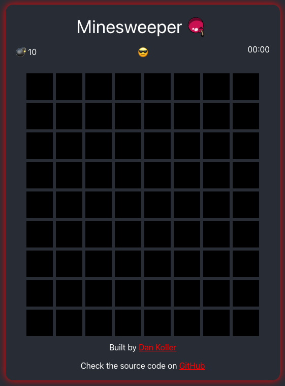

# React Minesweeper

This is a Minesweeper game written in React. I built this application in order to learn more about React and component based architecture. There is also a live demo available [here](https://dan-koller.github.io/minesweeper/).

<p align="center">
    
</p>

## Get started

-   Clone this repository:

```sh
git clone github.com/dan-koller/minesweeper.git
```

-   Navigate to the directory:

```sh
cd minesweeper
```

-   Install the dependencies:

```sh
npm install
```

-   Run the app locally:

```sh
npm start
```

Make sure to [use the production build](https://reactjs.org/docs/optimizing-performance.html#use-the-production-build) before deployment.

## How to play

This game follows the basic principe of the original Minesweeper from Windows (except that you can land on a mine
first try). You can clear, find and flag mines. To reset the field, just click onto the Emoji in the mid.
Have fun playing!

## Stack

-   Node.js 19
-   React 18
